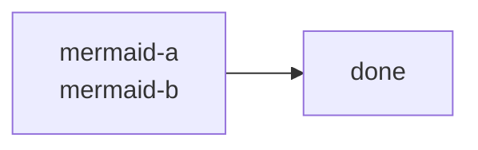

# HTML br E2E

## Plain text

plain-a<br>plain-b

slash-a<br/>slash-b

space-a<BR />space-b

attribute-a<br data-kind="soft">attribute-b

consecutive-a<br><br/>consecutive-b

## Rich text

**bold-a<br>bold-b**

*italic-a<br>italic-b*

[link-a<br>link-b](https://example.com)

- list-a<br>list-b

> quote-a<br>quote-b

## Table

| Plain | Styled | Formula |
| --- | --- | --- |
| table-a<br>table-b | **table-bold-a<br>table-bold-b** | $a<br>b$ |

## Literal boundaries

Encoded tag: &lt;br&gt;

Escaped tag: \<br>

Malformed tag: <br

Inline code: `inline-code-a<br>inline-code-b`

```html
block-code-a<br>block-code-b
```

Before standalone block.

<br>

After standalone block.

## Math isolation

Inline math: $a<br>b$

$$
c<br>d
$$

## Mermaid isolation


