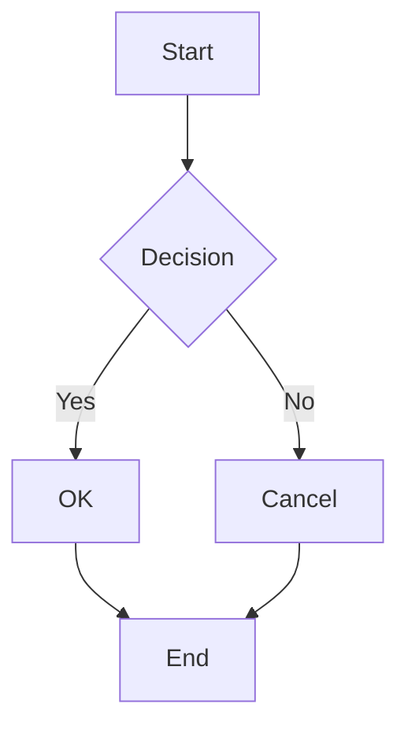
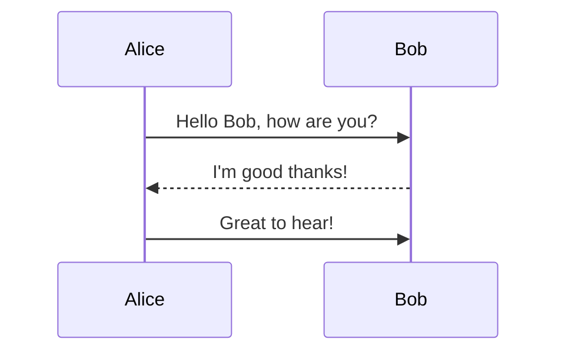
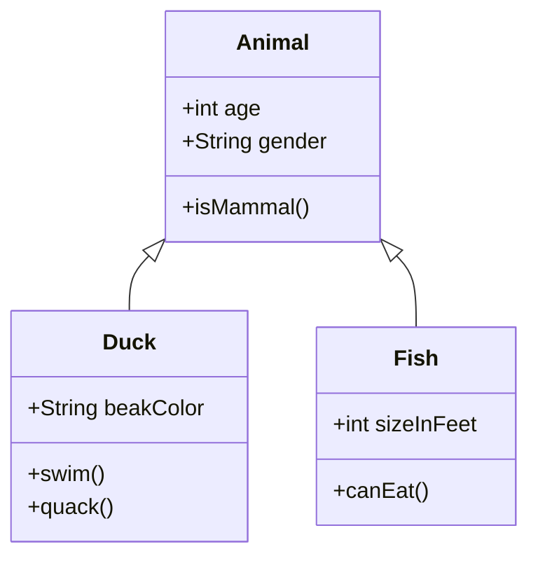

# Mermaid Test

## Flowchart



## Sequence Diagram



## Class Diagram



## Syntax Error (should fallback to code block)

```mermaid
graph TD
    A -->
```

## Normal Code Block (should not be affected)

```javascript
function hello() {
    console.log("Hello, World!");
}
```
