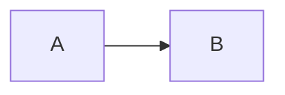
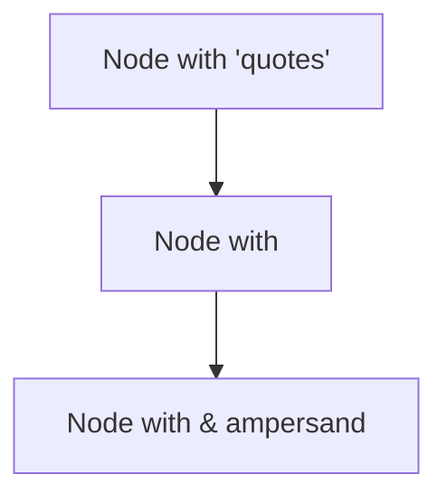
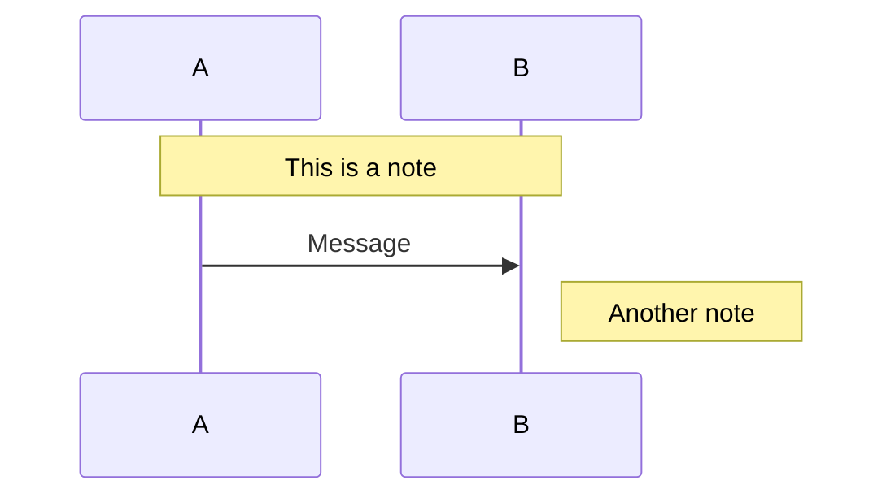
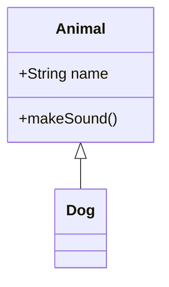

## Phase 1: Inline Parser Edge Cases

### Nested Formatting
**Bold with *nested italic* inside**

*Italic with **nested bold** inside*

***Bold and italic combined***

~~Strikethrough with **bold** and *italic*~~

### Special Characters in Formatting
**Bold with `code` inside**

*Italic with special chars: <>&"'*

### Empty and Edge Cases
** ** (spaces only)

*single word*

**a**

### Links with Special Characters
[Link with spaces](https://example.com/path%20with%20spaces)

[Link with **bold** text](https://example.com)

### Inline Code Edge Cases
`code with spaces`

`code with special chars: <>&"`

`` `backticks inside` ``

`single`

---

## Phase 2: Heading & List Edge Cases

### Headings with Special Characters
# Heading with `code` and **bold**

## Heading with <special> & "chars"

### Very Long Heading That Goes On And On And On And On And On And Should Still Work Properly

###### H6 Smallest Heading

### Deeply Nested Lists

1. First level ordered
   - Second level unordered
     1. Third level ordered
        - Fourth level unordered
          1. Fifth level ordered
             - Sixth level unordered

### Mixed List Types

1. Ordered item 1
   - Unordered child
   - Another unordered
2. Ordered item 2
   1. Ordered child
   2. Another ordered child
      - Mixed in unordered

### Task Lists

- [ ] Unchecked task
- [x] Checked task
  - [ ] Nested unchecked
  - [x] Nested checked

### Single Item Lists

- Single bullet

1. Single numbered

### List Items with Rich Content

- Item with **bold** and *italic*
- Item with `inline code`
- Item with [link](https://example.com)

---

## Phase 3: Container Element Edge Cases

### Empty Code Block

```
```

### Single Line Code Block

```python
print("hello")
```

### Code Block with Special Characters

```html
<div class="test">&nbsp;</div>
<script>alert('XSS');</script>
```

### Code Block with Backticks

```markdown
This is `inline code` in a code block
```

### Nested Quote Blocks

> Level 1 quote
> > Level 2 nested quote
> > > Level 3 deeply nested
> > Back to level 2
> Back to level 1

### Quote with Code

> Quote containing code:
> ```python
> def hello():
>     print("world")
> ```
> End of quote

### Quote with List

> Quote with a list:
> - Item 1
> - Item 2
>   - Nested item

### Empty Table Cells

| Header 1 | Header 2 | Header 3 |
|----------|----------|----------|
|          | middle   |          |
| left     |          | right    |

### Table with Formatting

| **Bold Header** | *Italic Header* | `Code Header` |
|-----------------|-----------------|---------------|
| **bold cell**   | *italic cell*   | `code cell`   |
| normal          | [link](url)     | mixed **b** *i* |

### Single Column Table

| Single |
|--------|
| one    |
| two    |

### Wide Table

| Col1 | Col2 | Col3 | Col4 | Col5 | Col6 | Col7 | Col8 |
|------|------|------|------|------|------|------|------|
| a    | b    | c    | d    | e    | f    | g    | h    |

### Horizontal Rules Variations

---

***

___

---

## Phase 4: Meta & Signature Edge Cases

### Large Text Block (for chunking test)

Lorem ipsum dolor sit amet, consectetur adipiscing elit. Sed do eiusmod tempor incididunt ut labore et dolore magna aliqua. Ut enim ad minim veniam, quis nostrud exercitation ullamco laboris nisi ut aliquip ex ea commodo consequat. Duis aute irure dolor in reprehenderit in voluptate velit esse cillum dolore eu fugiat nulla pariatur. Excepteur sint occaecat cupidatat non proident, sunt in culpa qui officia deserunt mollit anim id est laborum.

Sed ut perspiciatis unde omnis iste natus error sit voluptatem accusantium doloremque laudantium, totam rem aperiam, eaque ipsa quae ab illo inventore veritatis et quasi architecto beatae vitae dicta sunt explicabo. Nemo enim ipsam voluptatem quia voluptas sit aspernatur aut odit aut fugit, sed quia consequuntur magni dolores eos qui ratione voluptatem sequi nesciunt.

### Special Characters for Encoding

Characters: < > & " ' \ /
Unicode: 中文测试 日本語 한국어 Ελληνικά
Emoji: 🎉 🚀 ✅ ❌

### Mixed Content Paragraph

This paragraph has **bold**, *italic*, `code`, ~~strikethrough~~, [link](url), and special chars: <>&

---

## Phase 5: Math & Special Element Edge Cases

### Inline Math Variations

Simple: $x$

With spaces: $ x + y $

Subscript/superscript: $x_1^2$

Greek: $\alpha + \beta = \gamma$

Complex inline: $\frac{d}{dx}\left(\int_0^x f(t)dt\right) = f(x)$

Dot accent: $\dot{q}_0 = 700$

### Block Math Variations

Empty-ish:
$$
x
$$

Single line:
$$y = mx + b$$

Multi-line aligned:
$$
\begin{aligned}
a &= b + c \\
d &= e + f \\
g &= h + i
\end{aligned}
$$

Matrix:
$$
\begin{pmatrix}
a & b \\
c & d
\end{pmatrix}
$$

Complex with multiple environments:
$$
\begin{cases}
x + y = 1 \\
x - y = 0
\end{cases}
$$

### Math with Special LaTeX

$$
\text{This is text: } x = \frac{-b \pm \sqrt{b^2-4ac}}{2a}
$$

### Mermaid Diagram Variations

Simple flowchart:


Complex flowchart with special characters:


Sequence with notes:


Class diagram:


---

## End of Edge Cases Test
